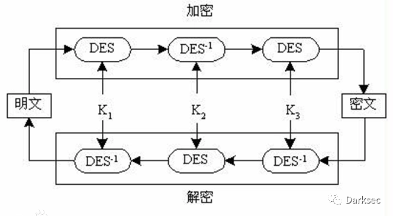

## 3DES

3DES（或称为Triple DES）是三重数据加密算法（TDEA，Triple Data Encryption Algorithm）块密码的通称。它相当于是对每个数据块应用三次DES加密算法。是DES的一个更安全的变形。

  由于计算机运算能力的增强，原版DES密码的密钥长度变得容易被暴力破解；3DES即是设计用来提供一种相对简单的方法，即通过增加DES的密钥长度来避免类似的攻击，而不是设计一种全新的块密码算法。

  3DES（即Triple DES）是DES向AES过渡的加密算法（1999年，NIST将3-DES指定为过渡的加密标准），加密算法，其具体实现如下：设Ek()和Dk()代表DES算法的加密和解密过程，K代表DES算法使用的密钥，P代表明文，C代表密文，这样：

```
3DES 加密过程为：C=Ek3(Dk2(Ek1(P)))

3DES 解密过程为：P=Dk1(EK2(Dk3(C)))
```

