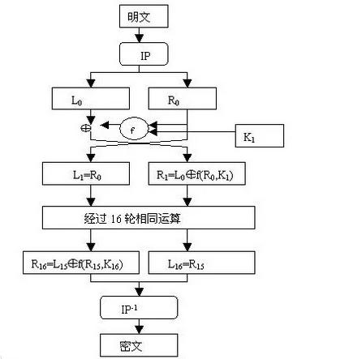
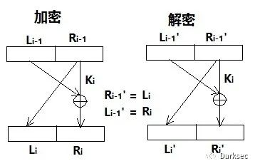

## 概述
  DES，Data Encrypt Standard，数据加密标准，DES 算法为密码体制中的对称密码体制，又被称为美国数据加密标准，
  是 1972 年美国 IBM 公司研制的对称密码体制加密算法。
  明文按 64 位进行分组，密钥长 64 位，密钥事实上是 56 位参与 DES 运算（第8、16、24、32、40、48、56、64位是奇偶校验位）。
  分组后的明文组和 56 位的密钥按位替代或交换的方法形成密文组的加密方法。

## 特点
  DES 算法具有极高安全性，除了用穷举搜索法对 DES 算法进行攻击外，还没有发现更有效的办法。
而 56 位长的密钥的穷举空间为 2^56，这意味着如果一台计算机的速度是每一秒钟检测一百万个密钥，则它搜索完全部密钥就需要将近 2285 年的时间，
可见，这是难以实现的。然而，这并不等于说 DES 是不可破解的。
而实际上，随着硬件技术和Internet的发展，其破解的可能性越来越大，而且，所需要的时间越来越少。使用经过特殊设计的硬件并行处理要几个小时。

## 应用误区
  由上述 DES 算法介绍我们可以看到：DES 算法中只用到 64 位密钥中的其中 56 位，而第 8、16、24、......64 位 8 个位并未参与 DES 运算，
  这一点，向我们提出了一个应用上的要求，即 DES 的安全性是基于除了 8，16，24，......64 位外的其余 56 位的组合变化 2^56 才得以保证的。
  因此，在实际应用中，我们应避开使用第 8，16，24，......64 位作为有效数据位，而使用其它的 56 位作为有效数据位，才能保证 DES 算法安全可靠地发挥作用。
  如果不了解这一点，把密钥 Key 的 8，16，24，..... .64 位作为有效数据使用，将不能保证 DES 加密数据的安全性，对运用 DES 来达到保密作用的系统产生数据被破译的危险，
  这正是 DES 算法在应用上的误区，留下了被人攻击、被人破译的极大隐患。

## 主要流程
  DES 算法把 64 位的明文输入块变为 64 位的密文输出块，它所使用的密钥也是 64 位，整个算法的主流程图如下：
  

## 算法密钥
  严格来讲，DES 算法的密钥长度为 56 位，通常用一个 64 位的数来表示密钥，然后经过转换得到 56 位的密钥，而第 8，16，24，......64 位是奇偶校验位，不参与 DES 加解密运算，所以这些位上的数值不能算作密钥。

  具体加解密运算之前，DES 算法的密钥还要通过置换、移位、迭代形成 16 个子密钥，分别供每一轮运算使用，每个子密钥为 48 比特。
  计算出子密钥是进行 DES 加密的前提条件。

  以下使用数据作为演示，输入为 01 23 45 67 89 AB CD EF（十六进制）<br> 
  二进制形式为 00000001 00100011 01000101 01100111 10001001 10101011 11001101 11101111 <br> 
  密钥为 13 34 57 79 9B BC DF F1（十六进制）<br> 
  二进制形式为 00010011 00110100 01010111 01111001 10011011 10111100 11011111 11110001

### （1）密钥置换
  密钥置换就是把一个 64 位长的初始密钥转变为 56 位的工作密钥。方法很简单，根据一个固定"站位表"让 64 位初始密钥中的对应位置的值出列，
  并"站"到表中去，置换表如下：

|57 |49 |41 |33 |25 |17 |9  |1  |58 |50 |42 |34 |26 |18 |
|---|---|---|---|---|---|---|---|---|---|---|---|---|---|
|10 |2  |59 |51 |43 |35 |27 |19 |11 |3  |60 |52 |44 |36 |
|63 |55 |47 |39 |31 |23 |15 |7  |62 |54 |46 |38 |30 |22 |
|14 |6  |61 |53 |45 |37 |29 |21 |13 |5  |28 |20 |12 |4  |

这一步生成的工作密钥为 11110000 11001100 10101010 11110101 01010110 01100111 10001111 

### （2）生成 16 个子密钥

  在 DES 的每一轮中，从 56 位工作密钥产生出不同的 48 位子密钥，确定这些子密钥的方式如下：

　　①. 将 56 位的密钥分成两部分，每部分 28 位。

　　②. 根据轮数，这两部分分别循环左移 1 位或 2 位。每轮移动的位数如下表：

|轮数 |1  |2  |3  |4  |5  |6  |7  |8  |9  |10 |11 |12 |13 |14 |15 |16 |
|---|---|---|---|---|---|---|---|---|---|---|---|---|---|---|---|---|
|位数 |1  |1  |2  |2  |2  |2  |2  |2  |1  |2  |2  |2  |2  |2  |2  |1  |

 移动后，从 56 位中选出 48 位。这个过程中，既置换了每位的顺序，又选择了子密钥，因此称为压缩置换。压缩置换规则如下表（注意表中没有9，18，22，25，35，38，43，54这8位）：

|14 |17 |11 |24 |1  |5  |3  |28 |15 |6  |21 |10 |
|---|---|---|---|---|---|---|---|---|---|---|---|
|23 |19 |12 |4  |26 |8  |16 |7  |27 |20 |13 |2  |
|41 |52 |31 |37 |47 |55 |30 |40 |51 |45 |33 |48 |
|44 |49 |39 |56 |34 |53 |46 |42 |50 |36 |29 |32 |

这一步把工作密钥平等拆成两块：
```
 Left0：  11110000 11001100 10101010 1111
 Right0： 0101 01010110 01100111 10001111
 ```
然后进行循环左移（把左边的数拿到右边），进行⼀共 16 轮运算：
```
SHIFT = [1,1,2,2,2,2,2,2,1,2,2,2,2,2,2,1]
```
L1：对 Left0 左移 1 位, 位数 = SHIFT[0] = 1 得到 1110000 1100110 0101010 1011111 <br>
R1：对 Right0 左移 1 位, 位数 = SHIFT[0] = 1 得到 1010101 0110011 0011110 0011110 <br>
然后进行拼接，L1 + R1：1110000 1100110 0101010 1011111 1010101 0110011 0011110 0011110 <br>
使⽤上表进行置换，L1R1 经过置换后的结果为： 00011011 00000010 11101111 11111100 01110000 01110010 <br>
得到了第⼀个⼦密钥 k1，注意，此时由 56 位变成了 48 位。

***
L2：对 L1 进行左移 SHIFT[1] 位, 得到 110000 1100110 0101010 10111111 <br>
R2：对 R1 进行左移 SHIFT[1] 位, 得到 010101 0110011 0011110 00111101 <br>
合并后得到 L2R2，与 上表 继续置换生成 k2
循环往复直到生成 k16，16 轮的 k 子密钥。

## 算法原理

  我们来看加密。首先对某个明文分组 M 进行初始变换 IP（Initial Permutation），变换依然是通过一张表格让明文出列站到表格上去，具体表格如下：

|58 |50 |42 |34 |26 |18 |10 |2  |
|---|---|---|---|---|---|---|---|
|60 |52 |44 |36 |28 |20 |12 |4  |
|62 |54 |46 |38 |30 |22 |14 |6  |
|64 |56 |48 |40 |32 |24 |16 |8  |
|57 |49 |41 |33 |25 |17 |9  |1  |
|59 |51 |43 |35 |27 |19 |11 |3  |
|61 |53 |45 |37 |29 |21 |13 |5  |
|63 |55 |47 |39 |31 |23 |15 |7  |

  IP 置换目的是将输入的 64 位数据块按位重新组合，并把输出分为 L0、R0 两部分，每部分各长 32 位。

  接着执行 16 次迭代：对 1<=n<=16，使用一个函数 f，输入两个区块（一个 32 位的数据区块和一个 48 位的密钥区块 Kn），
  输出一个 32 位的区块。定义符号 ⊕ 表示异或运算，让 n 从 1 循环到 16。

  以 i 轮为例

  

```
加密时有                 解密时有

Li=Ri-1　　　　　　　　   Li’=Ri-1‘ ==> Li’=Li=Ri-1　　

Ri=Li-1⊕F(Ri-1,Ki)     Ri’=Li-1‘⊕F(Ri-1’,Ki) ==> Ri’=Ri⊕F(Li,Ki)=Li-1⊕F(Ri-1,Ki)⊕F(Ri-1,Ki)=Li-1
```

结论：每轮加密和解密的中间结果都完全一样，且与 F 函数无关。而 F 函数越复杂，Ri 与 Li-1 的关系越复杂，因而越难被破解。

剩下的就是 F 函数是如何工作的了。为了计算 F，我们首先扩展每个 Rn-1，将其从 32 位拓展到 48 位，因为子密钥是 48 位的。这是通过使用一张表来重复 Rn-1 中的一些位来实现的，具体数据如下。

|32 |1  |2  |3  |4  |5  |
|---|---|---|---|---|---|
|4  |5  |6  |7  |8  |9  |
|8  |9  |10 |11 |12 |13 |
|12 |13 |14 |15 |16 |17 |
|16 |17 |18 |19 |20 |21 |
|20 |21 |22 |23 |24 |25 |
|24 |25 |26 |27 |28 |29 |
|28 |29 |30 |31 |32 |1  |

我们称这个过程为函数 E，也就是说函数 E(Rn-1) 输入 32 位输出 48 位。现在有了 48 位的结果，或者 8 组 6 比特数据。
我们现在要对每组 6 比特执行一些奇怪的操作：最终的结果就是，8 组 6 比特的数据被转换为 8 组 4 比特（一共 32 位）的数据。

将上一步 48 位的结果写成该形式：Kn⊕E(Rn-1) = B1B2B3B4B5B6B7B8，每个 Bi 都是一个 6 比特的分组，
我们现在计算 S1(B1)S2(B2)S3(B3)S4(B4)S5(B5)S6(B6)S7(B7)S8(B8)，其中 Si(Bi) 指的是第 i 个 S 盒的输出，输出一个 4 位的区块。
一个 S 盒就是一个 4 行 16 列的表，盒中的每一项都是一个 4 位的数。S 盒的 6 个输入确定了其对应的输出在哪一行哪一列，输入的高低两位做为行数 H，
中间四位做为列数 L，在 S-BOX 中查找第 H 行 L 列对应的数据。

S-BOX1

|14 |4  |13 |1  |2  |15 |11 |8  |3  |10 |6  |12 |5  |9  |0  |7  |
|---|---|---|---|---|---|---|---|---|---|---|---|---|---|---|---|
|0  |15 |7  |4  |14 |2  |13 |1  |10 |6  |12 |11 |9  |5  |3  |8  |
|4  |1  |14 |8  |13 |6  |2  |11 |15 |12 |9  |7  |3  |10 |5  |0  |
|15 |12 |8  |2  |4  |9  |1  |7  |5  |11 |3  |14 |10 |0  |6  |13 |

S-BOX2

|15 |1  |8  |14 |6  |11 |3  |4  |9  |7  |2  |13 |12 |0  |5  |10 |
|---|---|---|---|---|---|---|---|---|---|---|---|---|---|---|---|
|3  |13 |4  |7  |15 |2  |8  |14 |12 |0  |1  |10 |6  |9  |11 |5  |
|0  |14 |7  |11 |10 |4  |13 |1  |5  |8  |12 |6  |9  |3  |2  |15 |
|13 |8  |10 |1  |3  |15 |4  |2  |11 |6  |7  |12 |0  |5  |14 |9  |

S-BOX3

|10 |0  |9  |14 |6  |3  |15 |5  |1  |13 |12 |7  |11 |4  |2  |8  |
|---|---|---|---|---|---|---|---|---|---|---|---|---|---|---|---|
|13 |7  |0  |9  |3  |4  |6  |10 |2  |8  |5  |14 |12 |11 |15 |1  |
|13 |6  |4  |9  |8  |15 |3  |0  |11 |1  |2  |12 |5  |10 |14 |7  |
|1  |10 |13 |0  |6  |9  |8  |7  |4  |15 |14 |3  |11 |5  |2  |12 |

S-BOX4

|7  |13 |14 |3  |0  |6  |9  |10 |1  |2  |8  |5  |11 |12 |4  |15 |
|---|---|---|---|---|---|---|---|---|---|---|---|---|---|---|---|
|13 |8  |11 |5  |6  |15 |0  |3  |4  |7  |2  |12 |1  |10 |14 |19 |
|10 |6  |9  |0  |12 |11 |7  |13 |15 |1  |3  |14 |5  |2  |8  |4  |
|3  |15 |0  |6  |10 |1  |13 |8  |9  |4  |5  |11 |12 |7  |2  |14 |

S-BOX5

|2  |12 |4  |1  |7  |10 |11 |6  |5  |8  |3  |15 |13 |0  |14 |9  |
|---|---|---|---|---|---|---|---|---|---|---|---|---|---|---|---|
|14 |11 |2  |12 |4  |7  |13 |1  |5  |0  |15 |13 |3  |9  |8  |6  |
|4  |2  |1  |11 |10 |13 |7  |8  |15 |9  |12 |5  |6  |3  |0  |14 |
|11 |8  |12 |7  |1  |14 |2  |13 |6  |15 |0  |9  |10 |4  |5  |3  |

S-BOX6

|12 |1  |10 |15 |9  |2  |6  |8  |0  |13 |3  |4  |14 |7  |5  |11 |
|---|---|---|---|---|---|---|---|---|---|---|---|---|---|---|---|
|10 |15 |4  |2  |7  |12 |9  |5  |6  |1  |13 |14 |0  |11 |3  |8  |
|9  |14 |15 |5  |2  |8  |12 |3  |7  |0  |4  |10 |1  |13 |11 |6  |
|4  |3  |2  |12 |9  |5  |15 |10 |11 |14 |1  |7  |6  |0  |8  |13 |

S-BOX7

|4  |11 |2  |14 |15 |0  |8  |13 |3  |12 |9  |7  |5  |10 |6  |1  |
|---|---|---|---|---|---|---|---|---|---|---|---|---|---|---|---|
|13 |0  |11 |7  |4  |9  |1  |10 |14 |3  |5  |12 |2  |15 |8  |6  |
|1  |4  |11 |13 |12 |3  |7  |14 |10 |15 |6  |8  |0  |5  |9  |2  |
|6  |11 |13 |8  |1  |4  |10 |7  |9  |5  |0  |15 |14 |2  |3  |12 |

S-BOX8

|13 |2  |8  |4  |6  |15 |11 |1  |10 |9  |3  |14 |5  |0  |12 |7  |
|---|---|---|---|---|---|---|---|---|---|---|---|---|---|---|---|
|1  |15 |13 |8  |10 |3  |7  |4  |12 |5  |6  |11 |0  |14 |9  |2  |
|7  |11 |4  |1  |9  |12 |14 |2  |0  |6  |10 |13 |15 |3  |5  |8  |
|2  |1  |14 |7  |4  |10 |8  |13 |15 |12 |9  |0  |3  |5  |6  |1  |

我们得到 8 个 S 盒的输出后，函数 F 的最后一步就是对 S 盒的输出进行一个变换来产生最终值：
```
F = P(S1(B1)S2(B2)S3(B3)S4(B4)S5(B5)S6(B6)S7(B7)S8(B8))
```
其中，变换 P 由如下表格定义，输入 32 位数据，通过下标产生 32 位输出：


|16 |7  |20 |21 |29 |12 |28 |17 |
|---|---|---|---|---|---|---|---|
|1  |15 |23 |26 |5  |18 |31 |10 |
|2  |8  |24 |14 |32 |27 |3  |9  |
|19 |13 |30 |6  |22 |11 |4  |25 |

表中的数字代表原数据中此位置的数据在新数据中的位置，即原数据块的第 16 位放到新数据的第 1 位，第 7 位放到第 2 位，……依此类推，第 25 位放到第 32 位。最后，P 盒置换的结果与最初的 64 位分组左半部分 L0 异或。

在第 16 个迭代之后，就有了区块 L16 和 R16 接着我们逆转两个区块的顺序得到一个 64 位的区块 R16L16，然后对其执行一个最终的变换 IP-1，其定义如下所示：

|40 |8  |48 |16 |56 |24 |64 |32 |
|---|---|---|---|---|---|---|---|
|39 |7  |47 |15 |55 |23 |63 |31 |
|38 |6  |46 |14 |54 |22 |62 |30 |
|37 |5  |45 |13 |53 |21 |61 |29 |
|36 |4  |44 |12 |52 |20 |60 |28 |
|35 |3  |43 |11 |51 |19 |59 |27 |
|34 |2  |42 |10 |50 |18 |58 |26 |
|33 |1  |41 |9  |49 |17 |57 |25 |

解密就是加密的反过程，执行上述步骤，只不过在 16 轮迭代中调转左右子密钥的位置而已。
