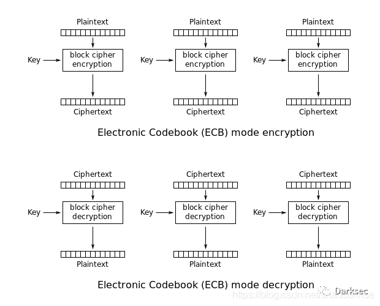
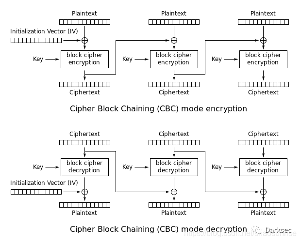
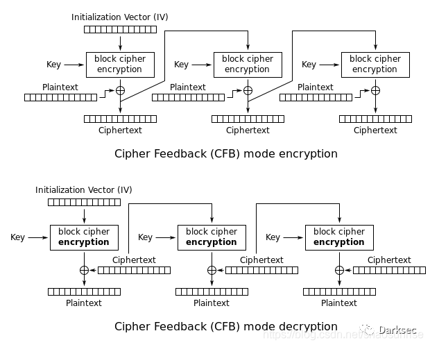
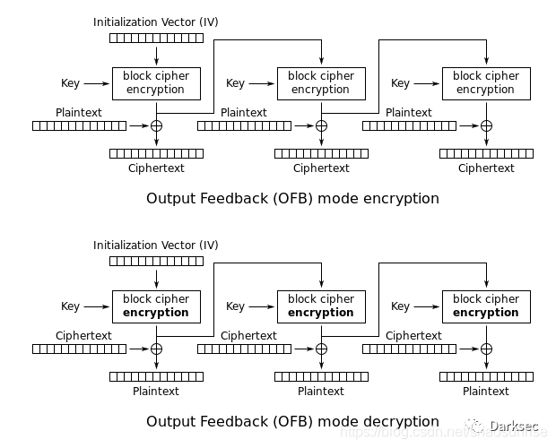
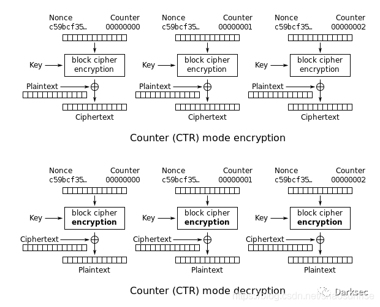

## 分组加密算法

分组加密算法又称快加密算法，就是一组一组进行加解密。它将明文分成多个等长的块（block，或称分组），使用确定的算法和对称密钥对每组分别进行加解密。
通俗地将，就是一组一组地进行加解密，而且每组数据长度相同。

## 工作模式

  分组算法的工作模式就是用来确认分组之间是否有关联以及如何关联的问题。不同的工作模式（也称加密模式）使得每个加密区块（分组）之间的关系不同。

  通常，分组算法有 5 种工作模式，如下：

|加密模式|特点 |
|----|---|
|ECB（电子密码本模式）|分组之间没有关联，简单快速，可并行计算|
|CBC（密码分组链接模式）|仅解密支持并行计算|
|CFB（加密反馈模式）|仅解密支持并行计算|
|OFB（输出反馈模式）|不支持并行计算|
|CTR（计算器模式）|不支持并行计算|

### ECB模式

ECB（Electronic Codebook, 电子密码本）模式是最简单的加密模式，明文消息被分成固定大小的块（分组），并且每个块被单独加密。
每个块的加密和解密都是独立的，且使用相同的方法进行加密，所以可以进行并行计算，但是这种方法一旦有一个块被破解，使用相同的方法可以解密所有的明文数据，安全性比较差。
适用于数据较少的情形，加密前需要把明文数据填充到块大小的整倍数。

### CBC模式

CBC（Cipher Block Chaining，密码块链）模式中每一个分组要先和前一个分组加密后的数据进行 XOR 异或操作，然后再进行加密。
这样每个密文块依赖该块之前的所有明文块，为了保持每条消息都具有唯一性，第一个数据块进行加密之前需要用初始化向量 IV 进行异或操作。
CBC 模式是一种最常用的加密模式，它主要缺点是加密是连续的，不能并行处理，并且与 ECB 一样消息块必须填充到块大小的整倍数。

### CFB模式

CFB（Cipher Feedback, 密码反馈）模式和 CBC 模式比较相似，前一个分组的密文加密后和当前分组的明文 XOR 异或操作生成当前分组的密文。CFB 模式的解密和 CBC 模式的加密在流程上其实是非常相似的。

### OFB模式

OFB（Output Feedback, 输出反馈）模式将分组密码转换为同步流密码，也就是说可以根据明文长度先独立生成相应长度的流密码。通过流程图可以看出，OFB和CFB非常相似，CFB是前一个分组的密文加密后XOR当前分组明文，OFB是前一个分组与前一个明文块异或之前的流密码XOR当前分组明文。由于异或操作的对称性，OFB模式的解密和加密完全一样的流程。

### CTR模式

CTR（Counter, 计数器）模式与OFB模式一样，计数器模式将分组密码转换为流密码。它通过加密“计数器”的连续值来产生下一个密钥流块。

## 短块加密

 分组密码一次只能对一个国定长度的明文（密文）块进行加（解）密。当最后一次要处理的数据小于分组长度时，就要进行特殊处理。这里把长度小于分组长度的数据称为短块。短块因为不足一个分组，所以不能直接进行加解密，必须采用合适的技术手段解决短块加解密问题。

对于短块处理，通常采用 3 种技术方法：

### （1）填充技术

  填充技术就是用无用的数据填充短块，使之成为标准块。填充方式可以自定义，比如填0、填充的数据长度值、随机数等。

### （2）密文挪用技术

  这种技术不需要引入新数据，只需把短块和前面分组的部分密文组成一个分组后进行加密。

### （3）序列加密

  对于最后一块短块数据，直接使用密钥 K 与短块数据模 2 相加。